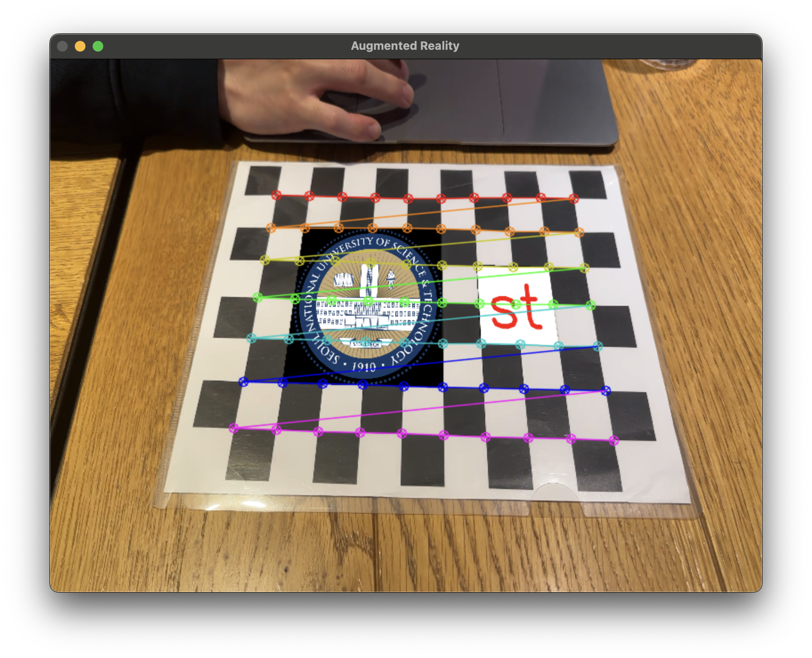

# 체스보드 기반 증강 현실(AR) 프로젝트



## 프로젝트 개요

이 프로젝트는 카메라로 체스보드 패턴을 인식하여 그 위에 이미지와 텍스트를 증강 현실(AR)로 표시하는 시스템입니다. 체스보드의 위치와 방향을 추적하여 지정된 이미지를 체스보드 위에 정확히 투영하고, 그 옆에 "st" 텍스트를 표시합니다.

## 주요 기능

- **체스보드 패턴 인식**: OpenCV를 사용하여 체스보드 패턴을 실시간으로 감지
- **카메라 포즈 추정**: 체스보드의 3D 위치와 방향 계산
- **이미지 투영**: 인식된 체스보드 위에 이미지 투영
- **텍스트 표시**: 이미지 옆에 "st" 텍스트를 2x2 체스보드 셀 크기로 표시
- **검출선 시각화**: 체스보드 검출 코너 시각적 표시

## 기술 구현

1. **카메라 캘리브레이션**: 정확한 AR 효과를 위한 카메라 내부 파라미터 계산
2. **체스보드 검출**: OpenCV의 `findChessboardCorners`를 사용하여 패턴 감지
3. **호모그래피 계산**: 인식된 체스보드 영역에 이미지와 텍스트 투영을 위한 변환 행렬 계산
4. **이미지 워핑 및 블렌딩**: 실시간으로 이미지를 체스보드 위에 표시
5. **텍스트 투영**: 텍스트가 체스보드 셀에 맞도록 투영

## 구현 세부사항

### 사용 기술

- **OpenCV**: 이미지 처리, 체스보드 인식, 호모그래피 계산
- **NumPy**: 행렬 연산 및 데이터 처리
- **Python**: 전체 프로그램 구현

### 핵심 알고리즘

1. **체스보드 검출 및 코너 정밀화**:
   ```python
   # 체스보드 코너 찾기
   ret, corners = cv.findChessboardCorners(gray, board_pattern, None)
   
   if ret:
       # 코너 위치 정밀하게 조정
       criteria = (cv.TERM_CRITERIA_EPS + cv.TERM_CRITERIA_MAX_ITER, 30, 0.001)
       corners = cv.cornerSubPix(gray, corners, (11, 11), (-1, -1), criteria)
   ```

2. **카메라 포즈 추정**:
   ```python
   # 카메라 포즈 계산
   _, rvec, tvec = cv.solvePnP(objp, corners, camera_matrix, dist_coeffs)
   ```

3. **호모그래피 계산 및 이미지 투영**:
   ```python
   # 이미지 호모그래피 계산
   H_img, _ = cv.findHomography(pts_src, img_points)
   
   # 이미지 투영
   warped_img = cv.warpPerspective(image_to_augment, H_img, (frame.shape[1], frame.shape[0]))
   ```

4. **마스크 생성 및 알파 블렌딩**:
   ```python
   # 이미지 마스크 생성
   img_mask = np.zeros(frame.shape[:2], dtype=np.uint8)
   cv.fillConvexPoly(img_mask, img_points.astype(int), 255)
   img_mask = cv.GaussianBlur(img_mask, (3, 3), 0.5)  # 경계 부드럽게
   img_mask_3channel = cv.cvtColor(img_mask, cv.COLOR_GRAY2BGR) / 255.0
   
   # 이미지 합성
   result = (1.0 - img_mask_3channel) * frame + img_mask_3channel * warped_img
   ```

## 결과 데모

아래는 프로그램 실행 결과의 스크린샷입니다:


실제 동작하는 모습은 아래 동영상에서 확인할 수 있습니다:

[](demo.mp4)

## 사용 방법

1. 필요한 라이브러리 설치:
   ```
   pip install opencv-python numpy
   ```

2. 카메라 캘리브레이션 파일 준비:
   - 'calibration_results/calibration_data.npz' 파일 이용

3. 투영할 이미지 준비:
   - 'image.png' 파일을 프로젝트 디렉토리에 위치

4. 프로그램 실행:
   ```
   python camera_pose_ar.py
   ```

5. 사용법:
   - 체스보드를 카메라 앞에 놓으면 자동으로 인식하여 이미지와 "st" 텍스트 투영
   - 'q' 키를 눌러 프로그램 종료
